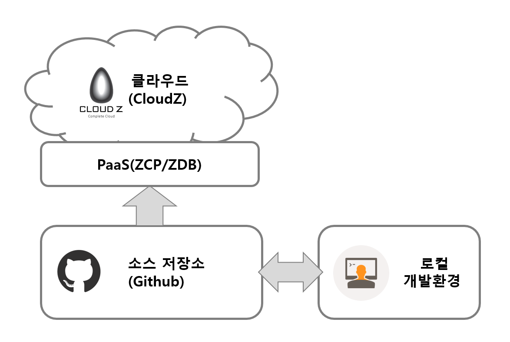

## 시작하기
행복성장플랫폼 가이드를 참고하면, 빠르고 쉽게 플랫폼을 활용할 수 있습니다. 

### 1. Cloud Native 란?
행복성장플랫폼은 Cloud Native Application을 지향하고 있습니다. 일반적인 의미에서 “클라우드 네이티브”는 클라우드 컴퓨팅 제공 모델의 이점을 활용하는 애플리케이션 구축 및 실행 접근 방법입니다. 클라우드 네이티브 앱 개발에는 일반적으로 데브옵스, 애자일 방법론, 마이크로서비스, 클라우드 플랫폼, 쿠버네티스 및 도커와 같은 컨테이너, 그리고 CI/CD 개념이 포함됩니다.

[현대적인 소프트웨어 개발 방법 ‘클라우드 네이티브’의 정의와 특징](http://www.itworld.co.kr/news/109679)


### 2. 행복성장플랫폼 구조
행복성장플랫폼은 Github-ZCP-CloudZ로 연결되는 CloudZ기반 오픈소스 플랫폼입니다.



### 3. 참고 기술요소
#### - Git
깃(Git /ɡɪt)은 프로그램 등의 소스 코드 관리를 위한 분산 버전 관리 시스템입니다. 분산 버전 관리 시스템을 쉽게 말하면, 여러명의 개발자(분산)가 특정 프로젝트를 자신의 컴퓨터로 협업하여 개발하면서 버전을 관리할 수 있는 시스템입니다. 

[Git이란 무엇인가?](https://medium.com/@psychet_learn/git-%EC%82%AC%EC%9A%A9%EB%B2%95-1%EA%B0%95-git%EC%9D%B4%EB%9E%80-%EB%AC%B4%EC%97%87%EC%9D%B8%EA%B0%80-340438d9a69f)

#### - Github
git을 호스팅해주는 웹 서비스이며,  git 저장소 서버를 대신 유지 및 관리해주는 서비스입니다. 다른 유저들과 함께 온라인으로 하나의 프로그램을 제작하는 것도 가능하여, 많은 오픈소스 프로그램들이 github을 통해서 전세계 유저들에 의해 제작되고 있습니다. 

[github란? - github 소개 및 설치](https://m.blog.naver.com/PostView.nhn?blogId=ufo7142&logNo=220628116787&proxyReferer=https%3A%2F%2Fwww.google.com%2F)

#### - JWT
행복성장플랫폼의 템플릿은 JWT를 이용하여 인증(토큰 기반 인증)을 하고 있습니다. JSON Web Token(JWT)은 웹표준 (RFC 7519)으로서 두 개체에서 JSON 객체를 사용하여 가볍고 자가수용적인 (self-contained) 방식으로 정보를 안전성 있게 전달해줍니다.

[토큰 기반 인증 간단 정리 Token based Authentication](https://blog.msalt.net/251)

[JSON Web Token 소개 및 구조](https://velopert.com/2389)

#### - Redis
행복성장플랫폼은 유효한 토큰을 White List로 관리하고 있으며, 이때 토큰 저장을 위해 Redis에 사용하고 있습니다. Redis는 REmote DIctionary Server의 약자로, 디스크가 아닌 메모리 기반의 데이터 저장소입니다. NoSQL & Cache 솔루션이며 대용량 처리 관련 기술입니다.

[Redis 개념과 특징](https://goodgid.github.io/Redis/)

### 4. 템플릿 Guide


## Welcome to GitHub Pages

You can use the [editor on GitHub](https://github.com/hitechinfo/guide/edit/master/index.md) to maintain and preview the content for your website in Markdown files.

Whenever you commit to this repository, GitHub Pages will run [Jekyll](https://jekyllrb.com/) to rebuild the pages in your site, from the content in your Markdown files.

### Markdown

Markdown is a lightweight and easy-to-use syntax for styling your writing. It includes conventions for

```markdown
Syntax highlighted code block

# Header 1
## Header 2
### Header 3

- Bulleted
- List

1. Numbered
2. List

**Bold** and _Italic_ and `Code` text

[Link](url) and 
```

For more details see [GitHub Flavored Markdown](https://guides.github.com/features/mastering-markdown/).

### Jekyll Themes

Your Pages site will use the layout and styles from the Jekyll theme you have selected in your [repository settings](https://github.com/hitechinfo/guide/settings). The name of this theme is saved in the Jekyll `_config.yml` configuration file.

### Support or Contact

Having trouble with Pages? Check out our [documentation](https://help.github.com/categories/github-pages-basics/) or [contact support](https://github.com/contact) and we’ll help you sort it out.
